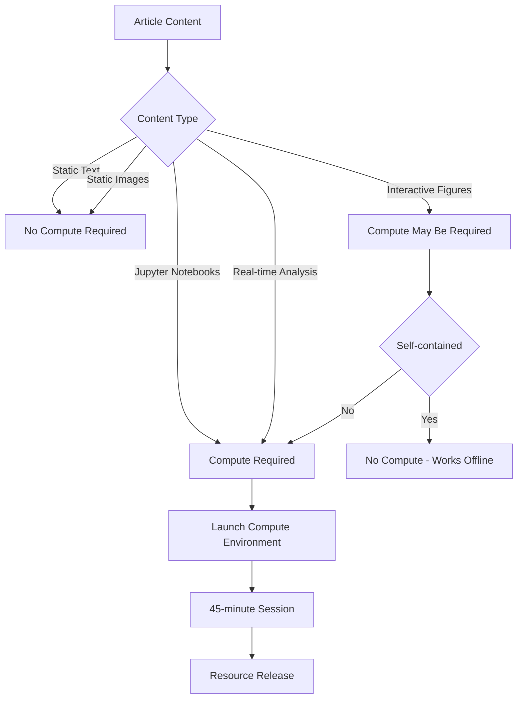
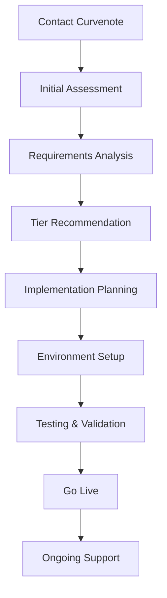

# Computational Tiers

## Overview
Understand Curvenote's compute service tiers and choose the right level of computational resources for your interactive articles and research projects

Curvenote provides a range of compute services delivered through a private BinderHub infrastructure, ensuring that all computational environments are isolated, secure, and optimized for performance. These tiers scale according to your needs, allowing you to select the appropriate level of compute resources based on expected traffic, interaction complexity, and computational requirements of your articles.

## Before You Start

Make sure you have:
- A Curvenote project with computational content
- Understanding of your expected user traffic and interaction patterns
- Knowledge of your computational requirements and complexity
- Budget considerations for compute resources
- Contact information for Curvenote consultation

## 1. Understand Compute Service Architecture

Learn how Curvenote's compute infrastructure works:

### Private BinderHub Infrastructure
```yaml
# Computational Infrastructure Overview
compute_services:
  infrastructure: "Private BinderHub"
  isolation: "Per-journal/article resource isolation"
  security: "Secure, managed computational environments"
  storage: "Pre-stored images for fast access"
  scaling: "On-demand resource allocation"
```

### Resource Allocation Model
```python
# Resource allocation example
class ComputeAllocation:
    def __init__(self, tier_level):
        self.tier = tier_level
        self.concurrent_users = 0
        self.active_sessions = []
        self.resource_limits = self.get_tier_limits()
    
    def get_tier_limits(self):
        limits = {
            'tier1': {'cpu': '2 cores', 'memory': '4GB', 'storage': '10GB'},
            'tier2': {'cpu': '4 cores', 'memory': '8GB', 'storage': '20GB'},
            'tier3': {'cpu': '8+ cores', 'memory': '16GB+', 'storage': '50GB+'}
        }
        return limits.get(self.tier, limits['tier1'])
    
    def check_availability(self):
        """Check if resources are available for new user."""
        return len(self.active_sessions) < self.resource_limits['max_users']
```

### On-Demand Activation


## 2. Explore Compute Tier Options

Choose from three main computational tiers:

### Tier 1: Shared Compute
**Entry-level compute service for lab groups and small journals**

**Characteristics:**
- **Infrastructure**: Shared end-user servers
- **Isolation**: Multi-tenant environment
- **Performance**: Suitable for lightweight interactions
- **Cost**: Most cost-effective option
- **Scaling**: Automatic resource sharing

**Best for:**
- Lab groups and small research teams
- Independent journals with low traffic
- Lightweight interactive visualizations
- Educational content and tutorials
- Proof-of-concept projects

**Resource Limits:**
```yaml
tier1_limits:
  cpu: "2 cores per session"
  memory: "4GB RAM per session"
  storage: "10GB per session"
  concurrent_users: "Up to 10 simultaneous sessions"
  session_timeout: "45 minutes"
  startup_time: "< 30 seconds"
```

### Tier 2: Dedicated Single Instance
**Dedicated compute host for individual journals or projects**

**Characteristics:**
- **Infrastructure**: Dedicated single-instance host
- **Isolation**: Journal/project-specific environment
- **Performance**: Improved availability and consistency
- **Cost**: Mid-range pricing
- **Scaling**: Manual scaling based on needs

**Best for:**
- Medium-sized journals and collections
- Research projects with moderate traffic
- Articles with complex interactive features
- Consistent performance requirements
- Growing computational needs

**Resource Limits:**
```yaml
tier2_limits:
  cpu: "4 cores per session"
  memory: "8GB RAM per session"
  storage: "20GB per session"
  concurrent_users: "Up to 25 simultaneous sessions"
  session_timeout: "45 minutes"
  startup_time: "< 20 seconds"
  availability: "99.5% uptime"
```

### Tier 3: Dedicated Cluster-Based Hub
**High-performance cluster for large-scale computational projects**

**Characteristics:**
- **Infrastructure**: Dedicated cluster-based hub
- **Isolation**: Complete resource isolation
- **Performance**: Maximum availability and reliability
- **Cost**: Premium pricing, cost-effective at scale
- **Scaling**: Automatic cluster scaling

**Best for:**
- Large journals and major publications
- High-traffic computational articles
- Complex data analysis workflows
- Real-time computational requirements
- Enterprise-level projects

**Resource Limits:**
```yaml
tier3_limits:
  cpu: "8+ cores per session"
  memory: "16GB+ RAM per session"
  storage: "50GB+ per session"
  concurrent_users: "50+ simultaneous sessions"
  session_timeout: "45 minutes"
  startup_time: "< 15 seconds"
  availability: "99.9% uptime"
  auto_scaling: true
```

## 3. Assess Your Computational Needs

Evaluate your requirements to choose the right tier:

### Traffic Analysis
```python
# Traffic assessment tool
def assess_traffic_needs(monthly_readers, interaction_rate, peak_multiplier):
    """
    Assess computational traffic needs.
    
    Args:
        monthly_readers: Average monthly unique readers
        interaction_rate: Percentage who use interactive features (0-1)
        peak_multiplier: Peak traffic multiplier (e.g., 3x for conferences)
    
    Returns:
        dict: Traffic assessment results
    """
    daily_readers = monthly_readers / 30
    daily_interactions = daily_readers * interaction_rate
    peak_daily_interactions = daily_interactions * peak_multiplier
    
    # Estimate concurrent users (assuming 45-minute sessions)
    concurrent_users = peak_daily_interactions * 0.1  # 10% concurrent
    
    return {
        'daily_interactions': daily_interactions,
        'peak_daily_interactions': peak_daily_interactions,
        'estimated_concurrent_users': concurrent_users,
        'recommended_tier': get_recommended_tier(concurrent_users)
    }

def get_recommended_tier(concurrent_users):
    """Get tier recommendation based on concurrent users."""
    if concurrent_users <= 10:
        return "Tier 1: Shared Compute"
    elif concurrent_users <= 25:
        return "Tier 2: Dedicated Single Instance"
    else:
        return "Tier 3: Dedicated Cluster-Based Hub"
```

### Computational Complexity Assessment
```python
# Complexity assessment
def assess_computational_complexity(article_features):
    """
    Assess computational complexity of articles.
    
    Args:
        article_features: List of computational features
    
    Returns:
        dict: Complexity assessment
    """
    complexity_scores = {
        'interactive_plots': 1,
        'data_analysis': 2,
        'machine_learning': 3,
        'large_datasets': 2,
        'real_time_computation': 3,
        '3d_visualizations': 2,
        'multiple_notebooks': 1
    }
    
    total_score = sum(complexity_scores.get(feature, 0) for feature in article_features)
    
    if total_score <= 3:
        return "Low complexity - Tier 1 suitable"
    elif total_score <= 6:
        return "Medium complexity - Tier 2 recommended"
    else:
        return "High complexity - Tier 3 recommended"
```

### Budget Considerations
```python
# Cost analysis
def estimate_compute_costs(tier, monthly_interactions, session_duration=0.75):
    """
    Estimate monthly compute costs.
    
    Args:
        tier: Compute tier (1, 2, or 3)
        monthly_interactions: Number of interactive sessions per month
        session_duration: Average session duration in hours
    
    Returns:
        dict: Cost estimates
    """
    # Base costs per tier (example values)
    base_costs = {
        1: {'base': 100, 'per_session': 0.10},
        2: {'base': 500, 'per_session': 0.25},
        3: {'base': 1500, 'per_session': 0.50}
    }
    
    tier_costs = base_costs.get(tier, base_costs[1])
    session_costs = monthly_interactions * session_duration * tier_costs['per_session']
    total_cost = tier_costs['base'] + session_costs
    
    return {
        'base_cost': tier_costs['base'],
        'session_costs': session_costs,
        'total_monthly_cost': total_cost,
        'cost_per_interaction': total_cost / monthly_interactions if monthly_interactions > 0 else 0
    }
```

## 4. Understand Resource Triggers

Learn when and how compute resources are activated:

### Static vs Interactive Content


### Interactive Content Types
```yaml
# Content classification
interactive_content:
  no_compute_required:
    - "Static interactive plots (Plotly, Altair)"
    - "Pre-rendered visualizations"
    - "Embedded data tables"
    - "Static code examples"
  
  compute_required:
    - "Jupyter notebook execution"
    - "Real-time data analysis"
    - "Dynamic model training"
    - "Live data streaming"
    - "Custom interactive widgets"
    - "Server-side computations"
```

### Session Management
```python
# Session tracking example
class ComputeSession:
    def __init__(self, user_id, article_id, tier):
        self.user_id = user_id
        self.article_id = article_id
        self.tier = tier
        self.start_time = time.time()
        self.last_activity = time.time()
        self.resources_allocated = self.allocate_resources()
    
    def allocate_resources(self):
        """Allocate compute resources based on tier."""
        resource_limits = {
            1: {'cpu': '2 cores', 'memory': '4GB'},
            2: {'cpu': '4 cores', 'memory': '8GB'},
            3: {'cpu': '8 cores', 'memory': '16GB'}
        }
        return resource_limits.get(self.tier, resource_limits[1])
    
    def check_timeout(self, timeout_minutes=45):
        """Check if session has timed out."""
        idle_time = time.time() - self.last_activity
        return idle_time > (timeout_minutes * 60)
    
    def release_resources(self):
        """Release allocated compute resources."""
        # Implementation for resource cleanup
        pass
```

## 5. Configure Your Compute Environment

Set up your computational environment for the chosen tier:

### Environment Configuration
```yaml
# curvenote.yml with compute settings
version: 1
project:
  title: "Your Computational Article"
  description: "Research with interactive computational features"

  # Compute tier configuration
  compute:
    tier: 2  # 1, 2, or 3
    environment: "environment.yml"
    resources:
      cpu: "4 cores"
      memory: "8GB"
      storage: "20GB"
    
    # Session settings
    session:
      timeout: 2700  # 45 minutes in seconds
      max_concurrent: 25
      auto_scale: false
    
    # BinderHub settings
    binderhub:
      enabled: true
      private: true
      image_storage: true
```

### BinderHub Configuration
```yaml
# .binder/environment.yml
name: computational-article
channels:
  - conda-forge
  - defaults
dependencies:
  - python=3.9
  - pandas>=1.5.0
  - numpy>=1.21.0
  - matplotlib>=3.5.0
  - plotly>=5.0.0
  - altair>=4.2.0
  - jupyterlab>=3.5.0
  - scipy>=1.9.0
  - scikit-learn>=1.1.0
  - pip
  - pip:
    - jupyterlab-myst>=0.2.0
    - myst-nb>=0.17.0
  # System dependencies for complex computations
  - gcc
  - gfortran
  - libopenblas-dev
  - liblapack-dev
```

### Resource Optimization
```python
# Resource optimization utilities
def optimize_for_tier(data, tier):
    """Optimize data and computations for specific tier."""
    optimizations = {
        1: {
            'max_data_size': '100MB',
            'max_points': 10000,
            'sampling': True,
            'caching': True
        },
        2: {
            'max_data_size': '500MB',
            'max_points': 50000,
            'sampling': False,
            'caching': True
        },
        3: {
            'max_data_size': '2GB',
            'max_points': 200000,
            'sampling': False,
            'caching': True
        }
    }
    
    return optimizations.get(tier, optimizations[1])

def create_tier_optimized_plot(data, tier):
    """Create plots optimized for specific tier."""
    config = optimize_for_tier(data, tier)
    
    if config['sampling'] and len(data) > config['max_points']:
        data = data.sample(n=config['max_points'], random_state=42)
    
    # Create plot with tier-appropriate settings
    fig = px.scatter(data, x='x', y='y')
    
    if config['caching']:
        # Enable caching for better performance
        fig.update_layout(
            uirevision='constant',  # Maintain zoom/pan state
            dragmode='select'
        )
    
    return fig
```

## 6. Monitor and Optimize Usage

Track and optimize your compute resource usage:

### Usage Monitoring
```python
# Usage monitoring utilities
class ComputeMonitor:
    def __init__(self, tier):
        self.tier = tier
        self.usage_stats = {
            'total_sessions': 0,
            'active_sessions': 0,
            'total_compute_time': 0,
            'peak_concurrent_users': 0
        }
    
    def track_session_start(self, user_id):
        """Track when a new session starts."""
        self.usage_stats['total_sessions'] += 1
        self.usage_stats['active_sessions'] += 1
        self.usage_stats['peak_concurrent_users'] = max(
            self.usage_stats['peak_concurrent_users'],
            self.usage_stats['active_sessions']
        )
    
    def track_session_end(self, duration):
        """Track when a session ends."""
        self.usage_stats['active_sessions'] -= 1
        self.usage_stats['total_compute_time'] += duration
    
    def get_utilization_rate(self):
        """Calculate resource utilization rate."""
        tier_limits = {
            1: 10,  # Max concurrent users for Tier 1
            2: 25,  # Max concurrent users for Tier 2
            3: 50   # Max concurrent users for Tier 3
        }
        
        max_users = tier_limits.get(self.tier, 10)
        return self.usage_stats['active_sessions'] / max_users
```

### Performance Metrics
```python
# Performance tracking
def track_performance_metrics(session_data):
    """Track performance metrics for compute sessions."""
    metrics = {
        'startup_time': [],
        'response_time': [],
        'error_rate': 0,
        'success_rate': 0
    }
    
    for session in session_data:
        metrics['startup_time'].append(session['startup_time'])
        metrics['response_time'].append(session['response_time'])
        
        if session['status'] == 'error':
            metrics['error_rate'] += 1
        else:
            metrics['success_rate'] += 1
    
    # Calculate averages
    metrics['avg_startup_time'] = np.mean(metrics['startup_time'])
    metrics['avg_response_time'] = np.mean(metrics['response_time'])
    metrics['error_rate'] = metrics['error_rate'] / len(session_data)
    metrics['success_rate'] = metrics['success_rate'] / len(session_data)
    
    return metrics
```

### Cost Optimization
```python
# Cost optimization strategies
def optimize_compute_costs(usage_data, tier):
    """Optimize compute costs based on usage patterns."""
    recommendations = []
    
    # Analyze usage patterns
    peak_hours = usage_data['peak_hours']
    off_peak_usage = usage_data['off_peak_usage']
    
    if tier == 1 and peak_hours > 80:
        recommendations.append("Consider upgrading to Tier 2 for better performance")
    
    if tier == 2 and off_peak_usage < 20:
        recommendations.append("Consider downgrading to Tier 1 to reduce costs")
    
    if tier == 2 and peak_hours > 90:
        recommendations.append("Consider upgrading to Tier 3 for scalability")
    
    return recommendations
```

## 7. Plan for Scaling

Prepare for growth and changing computational needs:

### Scaling Strategies
```yaml
# Scaling considerations
scaling_strategies:
  tier1_to_tier2:
    triggers:
      - "Consistent performance issues"
      - "Frequent resource exhaustion"
      - "User complaints about slow response"
      - "Peak concurrent users > 8"
    
    benefits:
      - "Improved performance consistency"
      - "Dedicated resources"
      - "Better availability"
      - "Custom scaling options"
  
  tier2_to_tier3:
    triggers:
      - "High traffic periods"
      - "Complex computational workflows"
      - "Real-time requirements"
      - "Peak concurrent users > 20"
    
    benefits:
      - "Maximum performance"
      - "Auto-scaling capabilities"
      - "Highest availability"
      - "Cost-effective at scale"
```

### Migration Planning
```python
# Migration planning utilities
def plan_tier_migration(current_tier, target_tier, usage_data):
    """Plan migration between compute tiers."""
    migration_plan = {
        'current_tier': current_tier,
        'target_tier': target_tier,
        'migration_steps': [],
        'estimated_downtime': 0,
        'cost_impact': 0
    }
    
    if current_tier == 1 and target_tier == 2:
        migration_plan['migration_steps'] = [
            "1. Schedule maintenance window",
            "2. Update curvenote.yml configuration",
            "3. Test new environment",
            "4. Migrate active sessions",
            "5. Update DNS/routing"
        ]
        migration_plan['estimated_downtime'] = "15 minutes"
    
    elif current_tier == 2 and target_tier == 3:
        migration_plan['migration_steps'] = [
            "1. Plan cluster deployment",
            "2. Set up load balancing",
            "3. Configure auto-scaling",
            "4. Migrate data and configurations",
            "5. Update monitoring and alerts"
        ]
        migration_plan['estimated_downtime'] = "30 minutes"
    
    return migration_plan
```

## 8. Contact and Consultation

Get help choosing and implementing the right compute tier:

### Consultation Process


### Contact Information
```markdown
## Get Started with Compute Tiers

### Consultation Request
- **Email**: [compute@curvenote.com](mailto:compute@curvenote.com)
- **Demo**: [Schedule a consultation](https://curvenote.com/demo)
- **Documentation**: [Compute Services Guide](https://docs.curvenote.com/compute)

### What to Prepare
- Current traffic patterns and user interaction data
- Computational requirements and complexity assessment
- Budget considerations and scaling expectations
- Timeline for implementation
- Technical requirements and constraints
```

### Implementation Timeline
```yaml
# Typical implementation timeline
implementation_timeline:
  week_1:
    - "Initial consultation and requirements gathering"
    - "Tier selection and configuration planning"
  
  week_2:
    - "Environment setup and testing"
    - "Configuration optimization"
  
  week_3:
    - "Integration with existing infrastructure"
    - "Performance testing and validation"
  
  week_4:
    - "Go-live preparation"
    - "Monitoring setup and alert configuration"
  
  ongoing:
    - "Performance monitoring and optimization"
    - "Scaling consultations as needed"
```

## Next Steps

- [Learn about Computational Best Practices →](./best-practices.md)
- [Create Computational Articles →](./computational-articles.md)
- [Create Interactive Figures →](./interactive-figures.md)
- [Embed Notebooks in Computational Content →](./embed-notebooks.md)
- [Understand Live Compute →](../live-compute.md)

---

💡 **Tip:** Start with Tier 1 for new projects and scale up based on actual usage patterns and user feedback. Follow these compute tier best practices:

- **Start small**: Begin with Tier 1 and scale based on actual needs
- **Monitor usage**: Track performance metrics and user satisfaction
- **Plan for growth**: Consider scaling requirements when choosing initial tier
- **Optimize costs**: Balance performance needs with budget constraints
- **Test thoroughly**: Validate computational workflows before going live
- **Document requirements**: Clearly document computational needs for consultation
