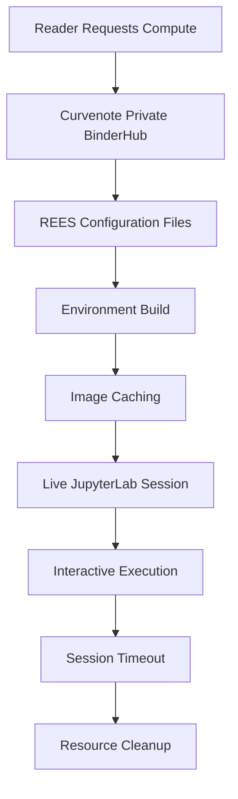
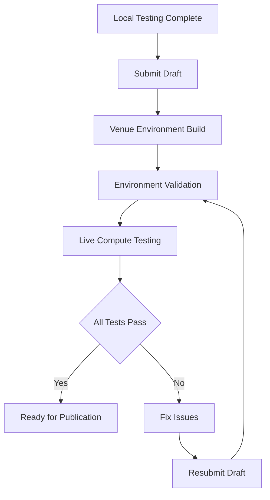

# Live Compute

## Overview
Set up and configure live computational environments using BinderHub and REES for interactive, reproducible research articles and reports

Live compute enables readers to interact with your computational content in real-time, executing code, exploring data, and running analyses directly within your published articles. Curvenote uses a private BinderHub infrastructure with REES (Reproducible Execution Environment Specification) to provide fast, secure, and reliable computational environments that enhance the reproducibility and interactivity of your research.

## Before You Start

Make sure you have:
- A Curvenote project with computational content
- Understanding of BinderHub and REES concepts
- Python or R environment management experience
- Knowledge of dependency management files (requirements.txt, environment.yml)
- Access to GitHub for testing on mybinder.org
- Curvenote CLI installed for local testing

## 1. Understand Live Compute Infrastructure

Learn how Curvenote's live compute system works:

### BinderHub and REES Overview
```yaml
# Live Compute Infrastructure
live_compute:
  infrastructure: "Private BinderHub"
  specification: "REES (Reproducible Execution Environment Specification)"
  caching: "Pre-stored images for fast startup"
  isolation: "Secure, isolated computational environments"
  scalability: "On-demand resource allocation"
```

### Architecture Components


### REES Configuration Files
```python
# REES file types and purposes
rees_files = {
    'requirements.txt': 'Python package dependencies',
    'environment.yml': 'Conda environment specification',
    'apt.txt': 'System-level dependencies',
    'postBuild': 'Post-build setup scripts',
    'start': 'Custom startup commands',
    'runtime.txt': 'Python version specification',
    'install.R': 'R package installation',
    'DESCRIPTION': 'R package metadata'
}
```

## 2. Set Up Your Computational Environment

Create a reproducible environment for your research:

### Python Environment Configuration
```yaml
# environment.yml
name: computational-research
channels:
  - conda-forge
  - defaults
dependencies:
  - python=3.9
  - pandas>=1.5.0
  - numpy>=1.21.0
  - matplotlib>=3.5.0
  - seaborn>=0.11.0
  - plotly>=5.0.0
  - altair>=4.2.0
  - jupyterlab>=3.5.0
  - scipy>=1.9.0
  - scikit-learn>=1.1.0
  - pip
  - pip:
    - jupyterlab-myst>=0.2.0
    - myst-nb>=0.17.0
    - ipywidgets>=7.6.0
```

### Requirements File Alternative
```txt
# requirements.txt
pandas>=1.5.0
numpy>=1.21.0
matplotlib>=3.5.0
seaborn>=0.11.0
plotly>=5.0.0
altair>=4.2.0
jupyterlab>=3.5.0
scipy>=1.9.0
scikit-learn>=1.1.0
jupyterlab-myst>=0.2.0
myst-nb>=0.17.0
ipywidgets>=7.6.0
```

### System Dependencies
```txt
# apt.txt
gcc
gfortran
libopenblas-dev
liblapack-dev
libhdf5-dev
libnetcdf-dev
```

### R Environment Setup
```r
# install.R
install.packages(c(
  "tidyverse",
  "ggplot2",
  "dplyr",
  "plotly",
  "DT",
  "rmarkdown",
  "knitr"
))
```

### Custom Build Scripts
```bash
# postBuild
#!/bin/bash
# Install additional packages or setup custom configurations
pip install --no-deps custom-package
R -e "install.packages('custom-r-package')"
```

## 3. Configure MyST Markdown Support

Enable MyST Markdown rendering in your computational environment:

### Add MyST Support
```yaml
# environment.yml with MyST support
name: computational-research
channels:
  - conda-forge
  - defaults
dependencies:
  - python=3.9
  - jupyterlab>=3.5.0
  - pip
  - pip:
    - jupyterlab-myst>=0.2.0
    - myst-nb>=0.17.0
    - myst-parser>=0.18.0
```

### MyST Configuration
```python
# myst_nb_config.py
# MyST-NB configuration for enhanced rendering
myst_enable_extensions = [
    "amsmath",
    "colon_fence",
    "deflist",
    "dollarmath",
    "html_image",
    "html_admonition",
    "replacements",
    "smartquotes",
    "substitution",
    "tasklist"
]

# Enable execution of notebooks
jupyter_execute_notebooks = "auto"
execution_excludepatterns = ["_build/*", "binder/*", ".*"]
```

### JupyterLab Extensions
```python
# jupyter_config.py
# JupyterLab configuration for MyST support
c.ServerApp.jpserver_extensions = {
    'jupyterlab_myst': True,
    'jupyterlab_git': True,
    'jupyterlab_lsp': True
}
```

## 4. Test on Public BinderHub

Validate your environment on mybinder.org before deployment:

### GitHub Repository Setup
```bash
# Initialize git repository
git init
git add .
git commit -m "Initial computational environment setup"

# Create .gitignore
echo "*.ipynb_checkpoints/" >> .gitignore
echo "__pycache__/" >> .gitignore
echo "*.pyc" >> .gitignore
echo "_build/" >> .gitignore
echo "*.zip" >> .gitignore

# Push to GitHub
git remote add origin https://github.com/yourusername/your-repo.git
git push -u origin main
```

### BinderHub URL Construction
```python
# Generate BinderHub URL
def create_binder_url(repo_url, branch="main", filepath=None):
    """Create BinderHub URL for testing."""
    base_url = "https://mybinder.org/v2/gh"
    
    if filepath:
        return f"{base_url}/{repo_url}/{branch}?filepath={filepath}"
    else:
        return f"{base_url}/{repo_url}/{branch}"

# Example usage
repo = "yourusername/your-repo"
url = create_binder_url(repo, filepath="notebooks/main.ipynb")
print(f"BinderHub URL: {url}")
```

### Environment Validation
```python
# test_environment.py
import sys
import importlib

def test_environment():
    """Test that all required packages are available."""
    required_packages = [
        'pandas', 'numpy', 'matplotlib', 'seaborn',
        'plotly', 'altair', 'jupyterlab', 'scipy',
        'sklearn', 'jupyterlab_myst'
    ]
    
    missing_packages = []
    
    for package in required_packages:
        try:
            importlib.import_module(package)
            print(f"✓ {package} is available")
        except ImportError:
            missing_packages.append(package)
            print(f"✗ {package} is missing")
    
    if missing_packages:
        print(f"\nMissing packages: {missing_packages}")
        return False
    else:
        print("\nAll packages are available!")
        return True

if __name__ == "__main__":
    test_environment()
```

## 5. Configure Curvenote Frontmatter

Set up your Curvenote project for live compute:

### Basic Configuration
```yaml
# curvenote.yml
version: 1
project:
  title: "Your Computational Article"
  description: "Research with live computational capabilities"
  
  # Enable live compute
  jupyter: true
  
  # Export formats
  exports:
    - format: meca
    - format: pdf
    - format: typst
  
  # REES configuration files
  requirements:
    - requirements.txt
    - environment.yml
    - apt.txt
  
  # Additional resources
  resources:
    - notebooks/*.ipynb
    - data/processed/*
    - src/**/*
    - models/*.pkl
```

### Advanced Configuration
```yaml
# curvenote.yml with advanced settings
version: 1
project:
  title: "Advanced Computational Article"
  description: "Complex research with multiple computational environments"
  
  # Live compute settings
  jupyter: true
  computational: true
  
  # Multiple environment support
  environments:
    - name: "main"
      requirements: ["requirements.txt", "environment.yml"]
      resources: ["notebooks/*", "data/*"]
    
    - name: "analysis"
      requirements: ["analysis-requirements.txt"]
      resources: ["analysis/*"]
  
  # Export configuration
  exports:
    - format: meca
    - format: pdf
    - format: typst
    - format: html
  
  # Computational tier
  compute:
    tier: 2
    timeout: 2700  # 45 minutes
    max_concurrent: 25
```

### MyST Configuration
```yaml
# myst.yml
version: 1
project:
  title: "MyST Computational Article"
  
  # MyST-specific settings
  myst:
    enable_extensions:
      - amsmath
      - colon_fence
      - deflist
      - dollarmath
      - html_image
      - html_admonition
      - replacements
      - smartquotes
      - substitution
      - tasklist
    
    # Notebook execution
    jupyter_execute_notebooks: "auto"
    execution_excludepatterns: ["_build/*", "binder/*", ".*"]
    
    # Interactive elements
    interactive_outputs: true
    hover_tooltips: true
```

## 6. Test Your Environment Locally

Validate your setup before submission:

### Local MECA Export
```bash
# Export MECA archive for testing
curvenote export meca

# Check the exported archive
ls -la _build/exports/
unzip -l _build/exports/*.zip
```

### Environment Validation Script
```python
# validate_environment.py
import zipfile
import yaml
import os

def validate_meca_archive(archive_path):
    """Validate MECA archive contents."""
    with zipfile.ZipFile(archive_path, 'r') as zip_file:
        contents = zip_file.namelist()
        
        # Check for required files
        required_files = [
            'requirements.txt',
            'environment.yml',
            'curvenote.yml'
        ]
        
        missing_files = []
        for file in required_files:
            if not any(file in content for content in contents):
                missing_files.append(file)
        
        if missing_files:
            print(f"Missing required files: {missing_files}")
            return False
        
        # Check for notebooks
        notebooks = [f for f in contents if f.endswith('.ipynb')]
        if not notebooks:
            print("No notebooks found in archive")
            return False
        
        print(f"Found {len(notebooks)} notebooks")
        print("MECA archive validation passed!")
        return True

def validate_curvenote_config():
    """Validate curvenote.yml configuration."""
    with open('curvenote.yml', 'r') as f:
        config = yaml.safe_load(f)
    
    # Check required fields
    required_fields = ['jupyter', 'exports', 'requirements']
    missing_fields = []
    
    for field in required_fields:
        if field not in config.get('project', {}):
            missing_fields.append(field)
    
    if missing_fields:
        print(f"Missing required fields: {missing_fields}")
        return False
    
    # Check MECA export
    exports = config['project'].get('exports', [])
    meca_export = any(exp.get('format') == 'meca' for exp in exports)
    
    if not meca_export:
        print("MECA export not configured")
        return False
    
    print("Curvenote configuration validation passed!")
    return True

if __name__ == "__main__":
    # Find MECA archive
    build_dir = "_build/exports"
    if os.path.exists(build_dir):
        archives = [f for f in os.listdir(build_dir) if f.endswith('.zip')]
        if archives:
            validate_meca_archive(os.path.join(build_dir, archives[0]))
    
    validate_curvenote_config()
```

### Performance Testing
```python
# performance_test.py
import time
import psutil
import subprocess

def test_environment_startup():
    """Test environment startup time."""
    start_time = time.time()
    
    # Simulate environment startup
    try:
        result = subprocess.run(
            ['python', '-c', 'import pandas, numpy, matplotlib'],
            capture_output=True,
            timeout=30
        )
        
        if result.returncode == 0:
            startup_time = time.time() - start_time
            print(f"Environment startup time: {startup_time:.2f} seconds")
            return startup_time < 10  # Should start within 10 seconds
        else:
            print("Environment startup failed")
            return False
            
    except subprocess.TimeoutExpired:
        print("Environment startup timed out")
        return False

def test_memory_usage():
    """Test memory usage of computational environment."""
    process = psutil.Process()
    memory_info = process.memory_info()
    
    memory_mb = memory_info.rss / 1024 / 1024
    print(f"Memory usage: {memory_mb:.2f} MB")
    
    return memory_mb < 1000  # Should use less than 1GB

if __name__ == "__main__":
    print("Testing computational environment...")
    
    startup_ok = test_environment_startup()
    memory_ok = test_memory_usage()
    
    if startup_ok and memory_ok:
        print("✓ Environment performance tests passed")
    else:
        print("✗ Environment performance tests failed")
```

## 7. Submit and Test in Venue Environment

Deploy your computational article for live testing:

### Draft Submission Process


### Submission Checklist
```yaml
# submission_checklist.yml
pre_submission:
  - "Environment works on mybinder.org"
  - "All dependencies are specified"
  - "MECA export generates correctly"
  - "Notebooks execute without errors"
  - "Interactive elements function properly"
  - "Performance is acceptable"

post_submission:
  - "Draft builds successfully"
  - "Live compute launches correctly"
  - "All interactive features work"
  - "Session timeout is appropriate"
  - "Resource usage is within limits"
  - "User experience is smooth"
```

### Troubleshooting Common Issues
```python
# troubleshoot.py
import subprocess
import sys

def check_common_issues():
    """Check for common live compute issues."""
    issues = []
    
    # Check Python version
    python_version = sys.version_info
    if python_version.major != 3 or python_version.minor < 8:
        issues.append("Python version should be 3.8+")
    
    # Check for large files
    large_files = []
    for root, dirs, files in os.walk('.'):
        for file in files:
            filepath = os.path.join(root, file)
            if os.path.getsize(filepath) > 100 * 1024 * 1024:  # 100MB
                large_files.append(filepath)
    
    if large_files:
        issues.append(f"Large files found: {large_files}")
    
    # Check for missing dependencies
    try:
        import pandas
        import numpy
        import matplotlib
    except ImportError as e:
        issues.append(f"Missing dependency: {e}")
    
    return issues

def fix_common_issues():
    """Provide solutions for common issues."""
    solutions = {
        "Python version": "Update environment.yml to specify Python 3.9+",
        "Large files": "Add large files to .gitignore or use data URLs",
        "Missing dependencies": "Add missing packages to requirements.txt",
        "Slow startup": "Optimize environment.yml and remove unused packages",
        "Memory issues": "Reduce dataset sizes or use data sampling"
    }
    
    return solutions
```

## 8. Monitor and Optimize Performance

Track and improve your live compute performance:

### Performance Monitoring
```python
# performance_monitor.py
import time
import psutil
import logging

class LiveComputeMonitor:
    def __init__(self):
        self.start_time = time.time()
        self.session_data = {
            'startup_time': 0,
            'memory_usage': 0,
            'cpu_usage': 0,
            'active_sessions': 0
        }
    
    def track_startup(self):
        """Track environment startup time."""
        startup_time = time.time() - self.start_time
        self.session_data['startup_time'] = startup_time
        
        if startup_time > 30:
            logging.warning(f"Slow startup time: {startup_time:.2f}s")
        
        return startup_time
    
    def track_resource_usage(self):
        """Track resource usage during session."""
        process = psutil.Process()
        
        memory_mb = process.memory_info().rss / 1024 / 1024
        cpu_percent = process.cpu_percent()
        
        self.session_data['memory_usage'] = memory_mb
        self.session_data['cpu_usage'] = cpu_percent
        
        return {
            'memory_mb': memory_mb,
            'cpu_percent': cpu_percent
        }
    
    def generate_report(self):
        """Generate performance report."""
        return {
            'startup_time': f"{self.session_data['startup_time']:.2f}s",
            'memory_usage': f"{self.session_data['memory_usage']:.2f}MB",
            'cpu_usage': f"{self.session_data['cpu_usage']:.1f}%",
            'recommendations': self.get_recommendations()
        }
    
    def get_recommendations(self):
        """Get optimization recommendations."""
        recommendations = []
        
        if self.session_data['startup_time'] > 20:
            recommendations.append("Consider optimizing environment.yml")
        
        if self.session_data['memory_usage'] > 500:
            recommendations.append("Consider reducing dataset sizes")
        
        return recommendations
```

### Optimization Strategies
```yaml
# optimization_strategies.yml
startup_optimization:
  - "Use conda-forge channel for faster package resolution"
  - "Specify exact package versions to avoid resolution delays"
  - "Remove unused dependencies"
  - "Use minimal base images"

memory_optimization:
  - "Sample large datasets for interactive exploration"
  - "Use efficient data structures (pandas, numpy)"
  - "Implement lazy loading for large files"
  - "Cache expensive computations"

performance_optimization:
  - "Pre-compute static visualizations"
  - "Use efficient plotting libraries (plotly, altair)"
  - "Implement proper error handling"
  - "Optimize notebook cell execution order"
```

## Next Steps

- [Learn about Computational Best Practices →](./best-practices.md)
- [Create Computational Articles →](./computational-articles.md)
- [Create Interactive Figures →](./interactive-figures.md)
- [Embed Notebooks in Computational Content →](./embed-notebooks.md)
- [Explore Computational Tiers →](./computational-tiers.md)

---

💡 **Tip:** Always test your environment on mybinder.org first before configuring for Curvenote. This helps identify issues early in the development process. Follow these live compute best practices:

- **Test early and often**: Validate on mybinder.org before submission
- **Optimize startup time**: Keep environment lean and efficient
- **Monitor performance**: Track resource usage and user experience
- **Document dependencies**: Clearly specify all required packages
- **Handle errors gracefully**: Implement proper error handling in notebooks
- **Plan for scale**: Consider computational tier requirements for your audience
