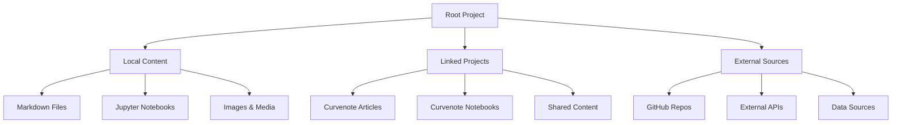
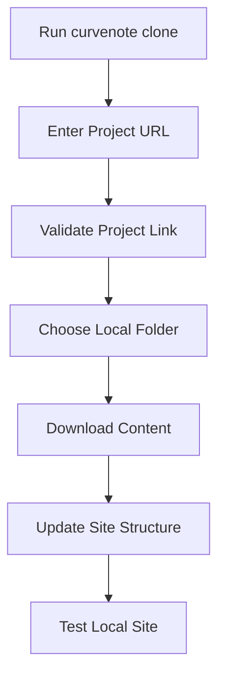

# Adding Content to Your Site

## Overview
Learn how to add new content to your Curvenote site, including local files, linked projects, and custom navigation

This guide shows you how to expand your Curvenote site by adding new content from multiple sources. You'll learn how to add local Markdown files and Jupyter notebooks, link to additional Curvenote projects, pull updated content, and customize your site's navigation structure.

## Before You Start

Make sure you have:
- Curvenote CLI installed and authorized
- A local Curvenote project set up
- Access to the Curvenote platform
- Understanding of basic Curvenote concepts
- Git repository (optional, for version control)

## 1. Understand Content Sources

Learn about the different ways to add content to your site:

### Content Source Types

**Local Files:**
- Markdown (.md) files
- Jupyter notebooks (.ipynb)
- Images and media files
- Configuration files

**Curvenote Projects:**
- Linked Curvenote projects
- Articles and notebooks from Curvenote
- Shared content from other users
- Template projects

**External Sources:**
- GitHub repositories
- External websites
- API integrations
- Data sources

### Project Structure


## 2. Add Local Files

Add new content files directly to your local project:

### Create New Markdown Files
```bash
# Create a new article
touch content/my-new-article.md

# Create a new section
mkdir content/new-section
touch content/new-section/index.md
touch content/new-section/article-1.md
touch content/new-section/article-2.md
```

### Markdown File Structure

**Basic Structure:**
- **Frontmatter**: Title, short title, and metadata
- **Main Content**: Article content with sections and subsections
- **References**: Links to related content and external resources

**Example Elements:**
- Title and introduction sections
- Main content with detailed explanations
- Code blocks and references
- Internal and external links

### Add Jupyter Notebooks

**Notebook Structure:**
Create Jupyter notebooks with markdown cells for documentation and code cells for analysis. Include proper metadata and kernel specifications.

**Example Content:**
- **Markdown Cell**: "# Data Analysis" with descriptive text
- **Code Cell**: Python code for data loading and analysis
- **Metadata**: Kernel specification and notebook format

### Organize Content Structure

**Articles:**
- `content/articles/main-article.md`
- `content/articles/supporting-article.md`

**Notebooks:**
- `content/notebooks/analysis.ipynb`
- `content/notebooks/visualization.ipynb`

**Data:**
- `content/data/raw/`
- `content/data/processed/`

**Images:**
- `content/images/figures/`
- `content/images/diagrams/`

**Assets:**
- `content/assets/documents/`
- `content/assets/code/`

## 3. Link Curvenote Projects

Connect additional Curvenote projects to your site:

### Clone Projects Using CLI
```bash
# Clone a Curvenote project
curvenote clone

# Interactive prompt will appear:
# ? Link to Curvenote project: (https://curvenote.com/@templates/curvespace)
```

### Project Linking Process


### Supported Link Formats

**Full Project URL:**
`https://curvenote.com/@username/project`

**Article URL:**
`https://curvenote.com/@username/project/article`

**Notebook URL:**
`https://curvenote.com/@username/project/notebook`

**OXA Link:**
`oxa:Eh6WvY9NT46Ds4lE3OqJ/unique-identifier`

**Example Links:**
- `https://curvenote.com/@stevejpurves/geoscience/phase-and-the-hilbert-transform`
- `oxa:Eh6WvY9NT46Ds4lE3OqJ/cMzSX755ZfawTQbU41BV`
- `https://curvenote.com/@templates/curvespace`

### Project Configuration

**Basic Configuration:**
- **Version**: 1
- **Title**: "Linked Project"
- **Description**: "Additional content from Curvenote"
- **Parent**: "main-project"

**Content Settings:**
- **Articles**: true
- **Notebooks**: true
- **Images**: true

**Navigation Settings:**
- **Include in Menu**: true
- **Menu Position**: 2

## 4. Manage Content Updates

Keep your content synchronized and up-to-date:

### Pull Updated Content
```bash
# Pull updates from all linked projects
curvenote pull

# Pull updates from specific project
curvenote pull --project project-name

# Pull with specific options
curvenote pull --force --clean
```

### Update Process

**Content Update Workflow:**
1. Check for updates: `curvenote status`
2. Pull latest content: `curvenote pull`
3. Review changes: `git diff`
4. Test local site: `curvenote start`
5. Commit changes: `git add . && git commit`
6. Deploy updates: `curvenote deploy`

**Update Monitoring:**
Use `curvenote status` to check if content needs updating. The command will show available updates for linked projects.


### Content Synchronization

**Synchronization Settings:**
- **Auto Pull**: false
- **Pull on Start**: true
- **Conflict Resolution**: manual

**Excluded Files:**
- `*.tmp`
- `*.log`
- `_build/*`
- `.git/*`

**Included Content:**
- `*.md`
- `*.ipynb`
- `*.png`
- `*.jpg`
- `*.svg`

## 5. Customize Navigation

Organize and structure your site's navigation:

### Table of Contents Configuration

**Basic TOC Structure:**
- **Format**: jb-book
- **Root**: index
- **Chapters**:
  - `content/blog/welcome` - Welcome
  - `content/blog/my-first-post` - My First Post
  - `content/geoscience/paper` - Geoscience Paper
  - `content/another-project/notebook` - Analysis Notebook

### Multi-Project Navigation

**Main Site:**
- Welcome
- About
- Contact

**Blog Section:**
- Latest Posts
- Categories
- Archive

**Research Section:**
- Publications
- Data
- Code

**Projects Section:**
- Current Projects
- Past Projects
- Collaborations

### Custom Navigation Links

**Navigation Frontmatter:**
- **Title**: Custom Navigation Example
- **Previous**: `../previous-article`
- **Next**: `../next-article`
- **Parent**: `../section-index`

[Previous Article →](../previous-article)
[Next Article →](../next-article)
[Back to Section →](../section-index)
## 6. Organize Content Structure

Consider different approaches to organizing your content for maintainability and clarity:

### Example Folder Structure

**Project Root:**
- `_build/` - Build outputs
- `public/` - Static assets (logo.svg, favicon.ico)
- `content/` - Main content directory
- `curvenote.yml` - Main configuration
- `README.md` - Project documentation

**Content Directory Structure:**
- `index.md` - Home page
- `about.md` - About page
- `blog/` - Blog section
  - `_toc.yml` - Table of contents
  - `welcome.md` - Welcome post
  - `my-first-post.md` - First blog post
- `research/` - Research section
  - `_toc.yml` - Table of contents
  - `publications/` - Publication files
  - `data/` - Research data
- `projects/` - Projects section
  - `_toc.yml` - Table of contents
  - `project-1/` - Individual project
- `notebooks/` - Jupyter notebooks
  - `analysis.ipynb` - Analysis notebook
  - `visualization.ipynb` - Visualization notebook

### Content Metadata

**Basic Metadata:**
- **Title**: "Article Title"
- **Short Title**: "Short Title"
- **Description**: "Brief description"
- **Authors**: "Author Name"
- **Date**: "2024-01-15"
- **Status**: "published" (draft, published, archived)

**Tags and Categories:**
- **Tags**: tag1, tag2
- **Categories**: category1

### File Naming Conventions

**Recommended Patterns:**
- **Markdown Files**: `kebab-case.md`
- **Notebooks**: `descriptive-name.ipynb`
- **Images**: `figure-01.png`
- **Data Files**: `dataset-name.csv`
- **Folders**: `section-name/`

**Good Examples:**
- `my-first-article.md`
- `data-analysis.ipynb`
- `figure-01-results.png`
- `experiment-data.csv`
- `research-papers/`

**Avoid:**
- `My First Article.md` (spaces and caps)
- `data_analysis.ipynb` (underscores)
- `figure1.png` (no descriptive name)
- `data.csv` (too generic)
- `Research Papers/` (spaces and caps)

### Content Organization Best Practices

For comprehensive guidance on organizing your content effectively, see [Computational Best Practices →](../Computational/best-practices.md) which covers:

- **Environment Management**: Setting up reproducible computational environments
- **Data Management**: Organizing data files and resources
- **Code Organization**: Structuring code and notebooks for maintainability
- **Documentation Standards**: Creating clear and consistent documentation
- **Version Control**: Managing changes and collaboration

## 7. Test and Validate Content

Ensure your content works correctly:

### Local Testing
```bash
# Start local development server
curvenote start

# Check for build errors
curvenote build

# Validate content structure
curvenote check
```

### Content Validation

**Validation Process:**
Use `curvenote check` to validate your content structure and identify potential issues.

**Validation Checks:**
- **Required Files**: Ensure index.md and curvenote.yml exist
- **Markdown Files**: Verify proper frontmatter in all .md files
- **Notebook Files**: Check for empty or corrupted .ipynb files
- **Internal Links**: Validate that all internal links point to existing files

### Performance Testing

**Build Performance:**
Use `curvenote build` to test your site build performance. Monitor build times and optimize if builds take longer than 30 seconds.

**Performance Monitoring:**
- Check build success/failure status
- Monitor build time duration
- Optimize content if builds are slow
- Review error messages for issues

## 8. Deploy and Share

Deploy your updated site and share with others:

### Deployment Process
```bash
# Deploy to Curvenote
curvenote deploy

# Deploy with specific options
curvenote deploy --project my-site --public

# Deploy to custom domain
curvenote deploy --domain mysite.com
```

### Deployment Configuration

**Deployment Settings:**
- **Auto Deploy**: false
- **Deploy on Push**: true
- **Public Access**: true

**Domains:**
- `mysite.curve.space`
- `custom-domain.com`

**Settings:**
- **Analytics**: true
- **Search**: true
- **Comments**: false

### Sharing and Collaboration

**Sharing Your Site:**
1. **Public Deployment**: Deploy your site publicly for anyone to access
2. **Private Sharing**: Share with specific users or teams
3. **Version Control**: Use Git for collaborative editing
4. **Feedback Collection**: Enable comments and feedback

**Collaboration Tools:**
- **Git Integration**: Track changes and collaborate via Git
- **Curvenote Teams**: Work with team members on Curvenote
- **Review Process**: Set up review workflows for content
- **Access Control**: Manage who can edit and publish content

## Next Steps

- [Learn about Updating Content →](../update-content.md)
- [Customize Site Design →](./site-design/layout-and-theme.md)
- [Configure Navigation →](./site-design/navigation.md)
- [Deploy Your Site →](./tutorial-deploy-project.md)
- [Manage Multiple Projects →](./sites/index.md)

---

💡 **Tip:** Start with a simple content structure and expand gradually. Use descriptive file names and organize content logically from the beginning.

