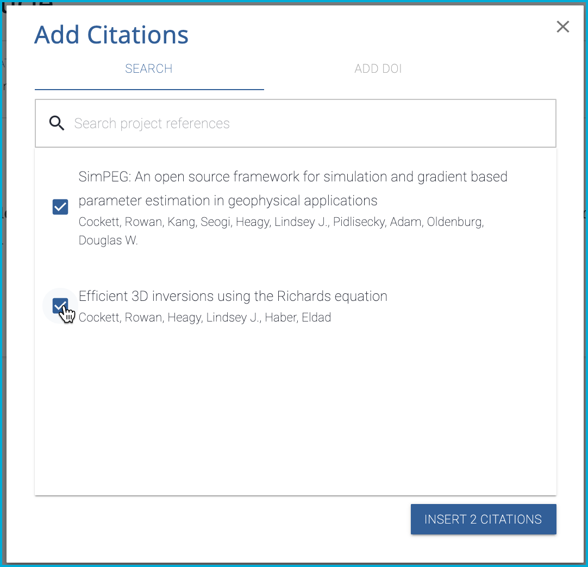

# Add Citations and References

## Quick Start
Add citations to your Curvenote articles using DOIs or BibTeX files with automatic formatting and reference management

You can easily add citations to your Curvenote articles and have quick access to them while you are typing. Citations can be added from DOIs or imported from BibTeX files, and they're automatically formatted according to your chosen style.

## Before You Start

Make sure you have:
- An article open in Curvenote
- DOIs for papers you want to cite, or
- A BibTeX file exported from your reference manager
- Your citation library set up in your project

## Video Demo 📺

[Watch the video tutorial](https://www.loom.com/embed/646329caf1e74c39bd6abb3835717ce0)

## 1. Add Citations from DOIs

A digital object identifier (DOI) is a unique string that permanently identifies an article or document on the web.

### Find the DOI
1. **Locate the DOI** on the article or document you want to cite
2. **Copy it to your clipboard**
3. **Note**: If you can't find the DOI, use the 'Search Metadata' option on [crossref.org](https://crossref.org)

### Add the Citation
1. **Place your cursor** where you want to add the citation
2. **Type `/cite`** to access the citation menu
3. **Navigate to "ADD DOI"**
4. **Enter the DOI** in the search bar
5. **Click "SEARCH"**
6. **Select "CREATE CITATION"** if the correct article appears

## 2. Import Citations from BibTeX Files

BibTeX files (`.bib`) are commonly used with LaTeX and can be exported from most reference managers like Zotero, Mendeley, or EndNote.

### Export from Reference Manager
1. **Open your reference manager** (Zotero, Mendeley, etc.)
2. **Select the references** you want to import
3. **Export as BibTeX** (`.bib` format)
4. **Save the file** to your computer

### Import to Curvenote
1. **Drag and drop** the `.bib` file into your Curvenote project
2. **Or use the upload button** in your project
3. **All references** will be added to your citation library
4. **Citation keys** will be automatically generated

[Watch video: Importing citations from BibTeX file](images/MshxlXndaLsk3WbJ0ZGy-RaR3QGIKD1ek3VXMAX31-v3.mp4)

## 3. Insert Citations in Your Text

Once citations are in your library, you can easily insert them:

### Single Citation
1. **Place your cursor** where you want the citation
2. **Type `/cite`** or `[[cite:`
3. **Search for the reference** you want to cite
4. **Select the citation** from the dropdown
5. **The citation** will be inserted automatically

### Multiple Citations
1. **Place your cursor** where you want the citations
2. **Type `/reference`** to access the references menu
3. **Use the search** to find references
4. **Check the boxes** for citations you want to add
5. **Click "INSERT CITATIONS"**

## 4. Format and Arrange Citations

### Citation Styles
Citations are automatically formatted according to your chosen style:
- **Parenthetical citations**: `{cite:p}` for (Author, Year)
- **Narrative citations**: `{cite:t}` for Author (Year)

### Group Citations
1. **Select a citation** in your text
2. **Click the `[]` button** in the toolbar to add brackets
3. **Drag citations** into and out of citation groups
4. **Rearrange citations** within groups as needed

## 5. Update and Manage Citations

### Update Existing Citations
1. **Re-export your BibTeX** from your reference manager
2. **Ensure citation keys** remain the same
3. **Re-upload the BibTeX file**
4. **All references** will be updated automatically

### Citation Keys
- **Format**: `ref-citationkey` (lowercase)
- **Example**: `Cockett2015-Elsevier` becomes `ref-cockett2015-elsevier`
- **Use for**: Quick lookup with `[[cite:` command

## Citation Examples

| Citation Type | Parenthetical Citation | Narrative Citation |
|---------------|------------------------|-------------------|
| 1 author | (Heinen, 2014) | Heinen (2014) |
| 2 authors | (Bartkowski & Smith, 2018) | Bartkowski and Smith (2018) |
| 3 or more authors | (Winter et al., 2018) | Winter et al. (2018) |
| Group author | (European Commission, 2020) | European Commission (2020) |

## Next Steps

- [Add Figures, Images, and Media →](./figures-and-images.md)
- [Create Internal References →](./internal-references.md)
- [Export to PDF/LaTeX →](./export-latex.md)

---

💡 **Tip:** Citations in Curvenote are clickable and will take you directly to the source article or document when clicked.

⚡ **Important:
Citation Management**

- Keep your BibTeX file updated in your reference manager
- Use consistent citation keys across your project
- Regularly sync your references to avoid conflicts
- Test your citations before finalizing your document
