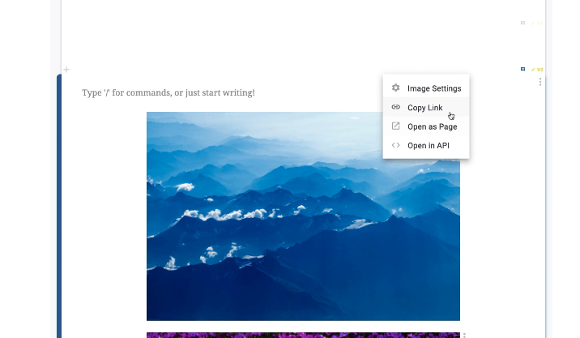
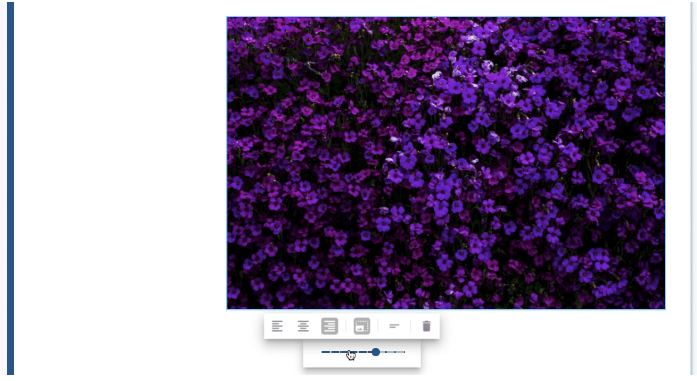
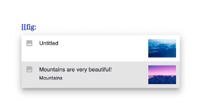
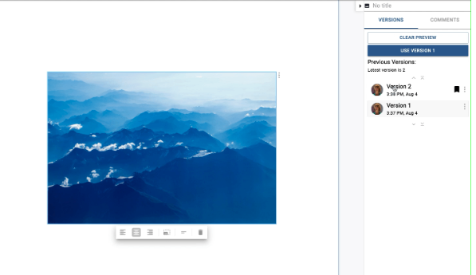

# Add Figures, Images, and Media

## Quick Start
Add images, GIFs, and other media to your articles with proper formatting, captions, and internal references

## Before You Start

Make sure you have:
- An article open in Curvenote
- Images, GIFs, or other media files ready to add
- Content in Draft Mode (click **EDIT** at the top of the page)

## Video Demo 📺

[Watch the video tutorial](https://www.loom.com/embed/6aa98f41d6f540cea5b759a1b9b0690f)

## 1. Add Images and GIFs

You can add static images (JPEG, TIFF, PNG) and GIFs using several methods:

### Method 1: Drag and Drop
- **Drag and drop** images from your computer directly into a content block
- A line will appear as you drag, and your images will appear below that line once dropped

### Method 2: Copy and Paste
- **Paste** images directly from your clipboard into a content block
- Images will automatically upload and appear in your content

### Method 3: Command Menu
- Open the **command menu** by typing `/` 
- Search for `image`
- Drag and drop your images into the box or click to browse and select files

### Method 4: Insert Menu
- Open the **insert menu** in the editing toolbar
- Select **Image**
- Drag and drop your images into the box or click to browse and select files

## 2. Create Standalone Image Blocks

To display an image as its own block (separate from text):

1. **Enter Draft Mode** for the page (click **EDIT** at the top)
2. **Select the block** above where you want to add your image
   - You may need to hit `esc` until the entire block is selected
   - Or click directly on the block selection tab (darker blue area)
3. **Paste your image** - a new block will appear below with just your image

## 3. Format Your Images

Once uploaded, you'll see a formatting toolbar that allows you to:

- **Adjust alignment** (left, center, right)
- **Change width** (percentage of page width)
- **Delete** the image if needed

## 4. Create Figures with Captions and Numbering

Images and GIFs can be formatted as **Figures** with automatic numbering and captions:

1. **Select the image** you want to format as a figure
2. **In the formatting toolbar:**
   - Click the lines symbol for **Show/Hide Caption**
   - When caption is shown, click the number icon for **Toggle Numbering**

Figures are automatically numbered by their location on the page, starting at 1.

## 5. Reference Figures in Your Text

You can reference figures by their numbers using internal references:

### Method 1: Command Menu
- Type `/link to figure` in your text
- Select the figure you want to reference from the dropdown menu

### Method 2: Keyboard Shortcut
- Type `[[fig:` in your text
- Select the figure you want to reference from the dropdown menu

When readers click on the reference, a preview of the image and its caption is displayed.

## 6. Manage Image Versions

Images are versioned independently in Curvenote. New versions are created when you:
- Replace the image
- Update the image caption

### Replace an Image
1. **Select the image** you want to replace
2. **Drag and drop or paste** a new image onto the previous one
3. A new version will be created automatically

### Use a Previous Version
1. **Select the image**
2. **Expand the Block Details Panel** on the right of the page
3. **Select a version** you want to use
   - A preview will appear in place of the current image
4. **Click "USE VERSION"**

## 7. Update Image Settings

You can access and update image settings including URL, title, description, caption, and tags:

### For Images in Content Blocks
1. Open the **⋮ Options menu** to the top-right of the image
2. Select **"Image Settings"**
3. Update the settings as needed
4. Click **"UPDATE SETTINGS"**

### For Standalone Image Blocks
1. Open the **⋮ Options menu** to the top-right of the block
2. Select **"Block Settings"**
3. Update the settings as needed
4. Click **"UPDATE SETTINGS"**

## Next Steps

- [Create Internal References →](./internal-references.md)
- [Add Interactive Outputs →](./interactive-outputs.md)
- [Link Data and Code →](./add-and-link-notebooks.md)

---

💡 **Tip:** Images and GIFs are treated as special blocks in Curvenote, meaning they can be reused across multiple articles and have their own versioning history.
