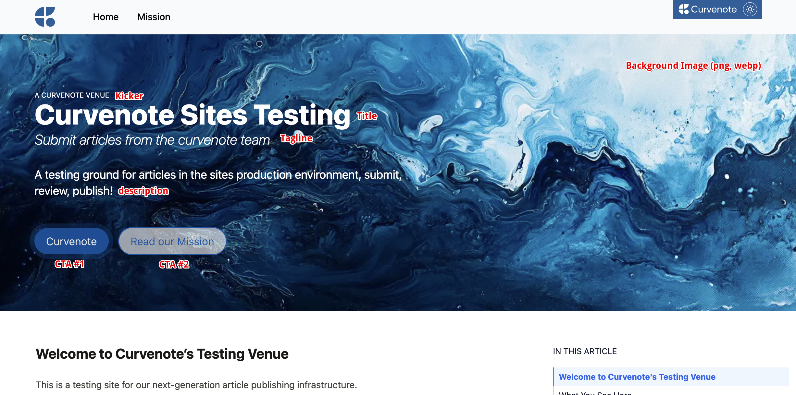
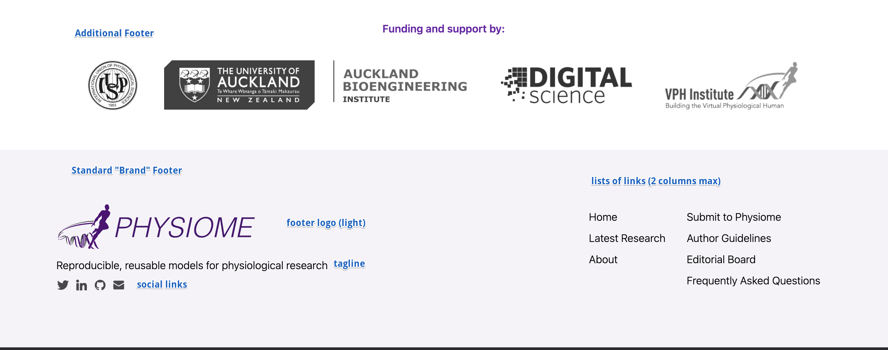
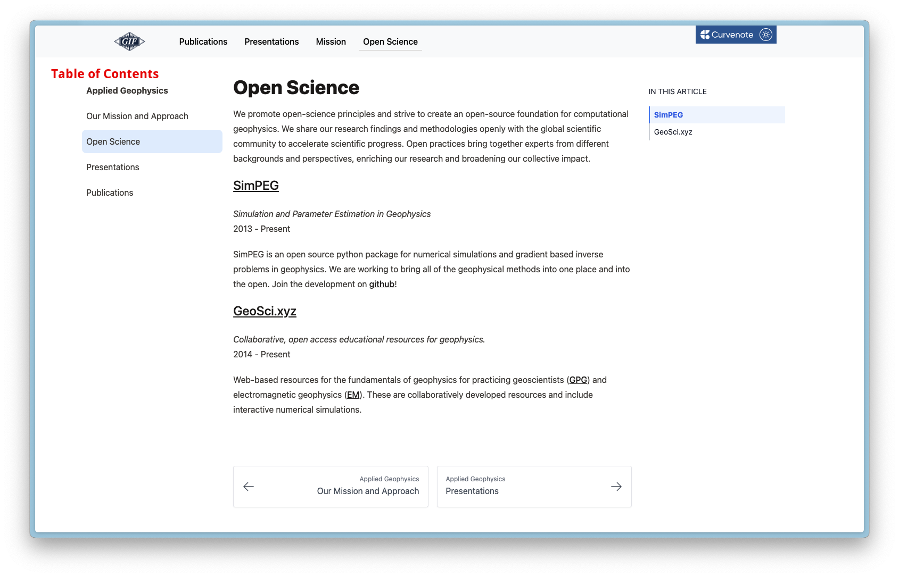
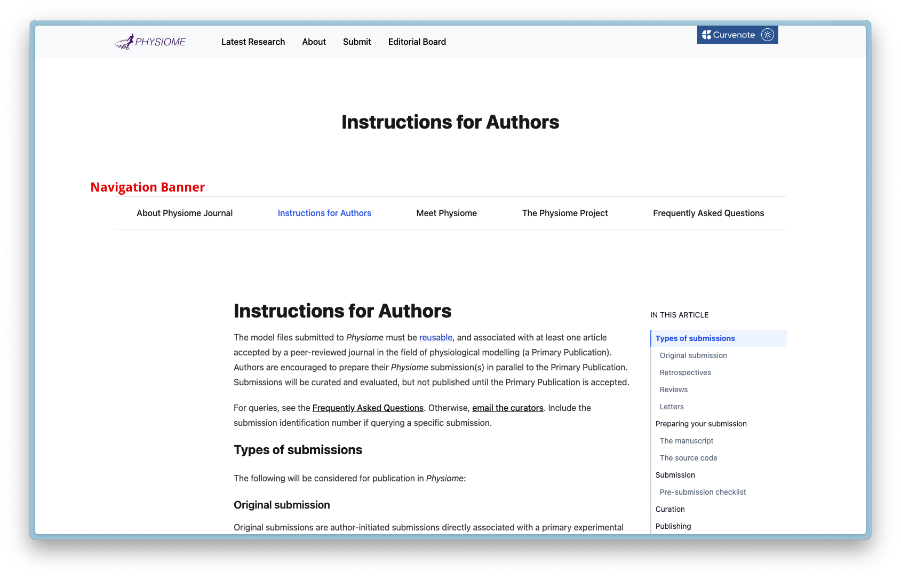
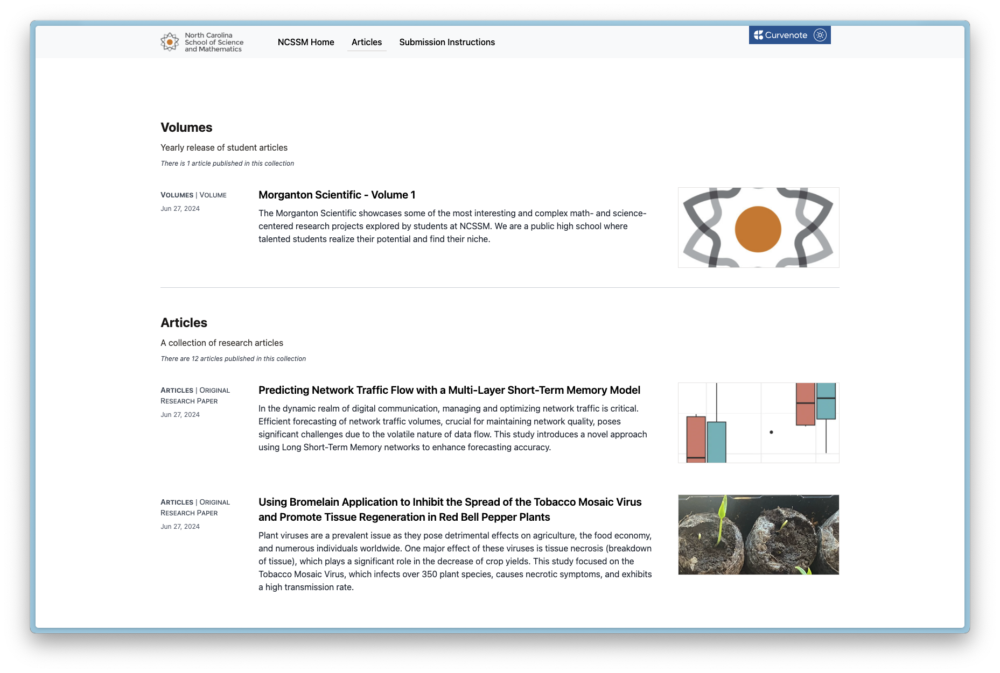

# Concepts

A Curvenote {term}`Site` aims to serve a broad set of branding and design alternatives via out-of-the-box customization & configuration.

When planning a site it's useful to think of customization & configuration in two categories:

1. The appearance, visual design, navigation, layout of the overall website and the general content
2. How published content (that is under editorial control) is presented, listed and organized

We'll explore both these two areas at a high level now, before getting into detailed descriptions.

## The Landing Site

Sites are structured as a top level "Landing Site" composed of [Landing Pages](landing-pages).

The landing site is written in MyST Markdown, giving you the ability to bring technical writing into any area of your site and the means to add elements via Curvenote's custom directives. The landing site's page layout and navigation structure generally controls the page structure and navigation of the site (although parts of the navigation can be overridden / extended if needed).

The landing site is typically managed via a github repository and can be configured via GitHub Actions to automatically deploy updates.

Individual pages on the landing site can written include listing directives that can either build [static lists from yaml files](#static-listings), or create [dynamic listings](#dynamic-listings) of published content from your site. In this way you choose how and where to present published works alongside or within your other content.

## The Published Content

Published Content is essentially the articles that you intend to publish on your site via the editorial controls Curvenote provides.

We call them _articles_ here but they can be any publication unit you decide upon; micropubs, blogs, video abstracts, long form research papers, executable notebook, and so on. You can support multiple types of _article_ by identifying each with a [Submission Kind](kinds) and further organize them within [Collections](collections).

The key point is that each article is a self contained {term}`Work`, which is submitted to a {term}`Site` to create a {term}`Submission`, versions of which are then managed in an editorial workflow. Typically, articles are submitted from GitHub, either via independent GitHub repos based on a template or a single monorepo that authors can fork and add to, Curvenote provides GitHub Actions to manage submissions in both cases.

Published content can be previewed and reviewed prior to it being published publically on the {term}`Site`. It is also possible to publish "unlisted" articles simply by not including a listing for specific Kinds or Collections in your landing site.

## Adding Project Documentation

In some cases, you may have a body of additional MyST content that you want to incorporate into your site alongside or as part of your landing site but that is managed in a separate repository on it's own lifecycle. Consider achieving this including using git submodules to incorporate it into your landing site directly and building it to your [table of contents](https://mystmd.org/guide/table-of-contents).

# Preparation

The following checklist includes aspects to consider when planning your site, where appropriate these link to examples either in the page below or externally.

- Design
  - Primary & Secondary brand colors (e.g. #0154a4 or #616161)
  - Brand logo and dark mode logo, displayed in the top navigation bar (svg or png)
  - Where does the logo link to? `/` or external?
- Landing Site
  - Body font
  - [Hero Unit](#hero-unit)
    - Background Image [example](https://cdn.curvenote.com/static/site/scipy/scipy-hero-v2-tilt.webp)
    - Background Color
    - Heading
    - Kicker
    - Tagline
    - Description
    - Alignment (left, center)
    - Boxed ([example](https://www.appliedgeophysics.org/))
    - styling - each text element can be styled
    - Up to 2 Buttons ([example](https://www.appliedgeophysics.org/), [example](https://proceedings.scipy.org/), [example](https://agrogeo24.curve.space/)), each has:
      - url
      - title
      - styling
      - Open in new tab
  - [Footer](#footers)
    - Logo and dark mode logo, usually larger than the Brand logo (svg or png)
    - Tagline
    - Social links
    - Listed Links
  - [Top Level Navigation](#top-level-navigation) shown in the top navigation bar
  - Content
    - Pages
      - Index page
        - show table of contents (default off)
        - Custom second level footer
      - People / Team Page - [example](https://colab.stanford.edu/people)
      - News Page - External, [static listing](#static-listings), [example](https://colab.stanford.edu/news)
    - Show [Table of Contents](#example-toc) vs [Navigation Banner](#example-navigation-banner)
    - Show document outline
    - Grid - centered, left
- Published Content
  - Submission Kinds, for each:
    - name - machine readable slug, all lower case
    - title
    - description
    - Computational Options (site-wide, per submission kind and separate options for landing site if needed)
      - BinderHub / JupyterHub target service
      - Enable/disable executable Figures, [example](https://www.elementalmicroscopy.com/articles/EM000002/aberration-fitting#py4dstem-parallax-shifts-interactive)
      - Enable/disable launch Jupyter links/buttons, [example](https://agu.curve.space/articles/NN0002)
      - Enable/disable execution in Notebooks [example](https://www.elementalmicroscopy.com/articles/EM000002/py4dstem-parallax-masks)
    - Layout
      - grid - left, normal, centered
      - Enable/disable table of contents
      - Enable/disable supporting documents
      - Enable/disable document outline
  - Collections, for each:
    - name
    - title
    - description
    - list of kinds

(hero-unit)=

## The Hero Unit



[example](https://proceedings.scipy.org/), [example](https://agrogeo24.curve.space/), [example](https://journal.physiomeproject.org/)

(footers)=

## The Footers



(top-level-navigation)=

## The Top Navigation Bar


## Landing site Navigation

By default the Table of Contents, Navigation Banner and document outline is not shown on the index page.

(example-toc)=

### Table of Contents

A table of contents can be shown on all of the landing site pages.



(example-navigation-banner)=

### Navigation Banner

Alternatively the table of contents can be shown as a navigation banner that includes top level pages only,
links to nested pages will not be visible.



## Article Listings

A site wide article feed can be exposed that lists all collections in one place. This will be superceded by directive based
listings over time and we recommend you use try and use directives instead. However, until that pattern is well extablished
the articles page can be added to the nav by adding the following to your curvenote/myst.yml:

```yaml
# curvenote/myst.yml#site.nav
site:
  nav:
    - title: Articles
      url: /articles
```

This will result in somethig like this, depending on your collection and kind setup



### Directive Based Listings

Directives allow you to control how articles are listed, and which collections/kinds are listed where as well as being abel to put content around them.

Examples of different directive based listings are:

- [here](https://www.appliedgeophysics.org), where [publications](https://www.appliedgeophysics.org/publications) and [presentations](https://www.appliedgeophysics.org/presentations)
- and [here](https://proceedings.scipy.org/2024) where each year of the proceedings is dynamically built

To see how the directives are used see the [github repo here](https://github.com/curvenote/scipy-landing)
