# Create a Site

:::{tip} ObjectiveCreate a publishing destination for your articles, lab notebooks, or group collections. :::

## Quick Checklist

- Have a Curvenote account & CLI installed
- Access or create a site (web admin)
- Configure your project (curvenote.yml)
- Organize local content (if using Git/GitHub)
- Add metadata to each file
- Submit content to a site & collection
- Push changes for internal review (optional)
- Run checks before publishing (optional)
- Publish (admin only)

## Workflow at a Glance

```mermaid
graph TD
    A[1. Create Site<br/>web admin] --> B[2. Set Landing Page]
    B --> C[3. Organize Content<br/>optional for local/Git]
    C --> D[4. Add Metadata]
    D --> E[5. Submit Content]
    E --> F[6. Push Changes<br/>optional]
    F --> G[7. Run Checks<br/>optional]
    G --> H[8. Publish<br/>admin only]
    H --> I[🎉 Site Live!]
    
    style A fill:#e1f5fe
    style I fill:#c8e6c9
```



**Text Version:**

```
[1] Create Site (web admin)
        ↓
[2] Set Landing Page
        ↓
[3] Organize Content (optional for local/Git)
        ↓
[4] Add Metadata
        ↓
[5] Submit Content → [6] Push Changes (optional)
        ↓
[7] Run Checks (optional)
        ↓
[8] Publish (admin only)
        ↓
    🎉 Site Live!
```
 ## Before You Begin
:::{important} Make sure you have:

- A Curvenote account and Curvenote CLI installed
- Access to an existing site (or permission to create one via the web admin interface)
- A configured project (curvenote.yml) if publishing from GitHub or locally
:::


### 1. Create a Site (via Web Admin)

Currently, new sites must be created through the web admin interface.

- Choose a title and subdomain (e.g., `my-lab.curve.space`)
- Set the site visibility (public or private)
- Define the organization or group that owns the site

_Coming Soon: Site creation directly from the CLI._

### 2. Set a Landing Page or Featured Work

Once the site exists, an admin can define a “landing page” — the main entry point for visitors.

- Recommended: Set this via the web admin interface
- CLI support available for some workflows

### 3. Organize Your Content (Optional, CLI or Git-based Workflows)

If you are managing content locally (e.g., in GitHub), organize your files into logical directories:

- **Full Research Articles:** `articles/`
- **Figures/Methods:** `components/`
- **Landing page:** `index.md`

For sites with community submissions, content organization happens after submission.

### 4. Add Metadata 

Each content file should have frontmatter with key details:

```yaml
---
title: 'An Advanced Microscopy Study'
authors:
  - name: Dr. Lee
kind: article
---
```

Metadata enables automated checks, collection assignment, and proper formatting

### 5. Submit Content to a Site and Collection

From your local project, run:

```bash
curvenote submit
```

You’ll be prompted to:

- Select an existing site
- Choose a collection (e.g., "Lab Articles")

This prepares your content for publishing and notifies site administrators.

### 6. Push Changes (Optional: Internal Review)

```bash
curvenote push
```

This allows collaborators to preview your work, but does not make it publicly visible.

### 7. Run Checks (Optional but Recommended)


```bash
curvenote check
```

This will run structural and metadata checks and highlight any issues.

> 💡 **Tip:** For more details on how to run a structural check, visit this page (link)

### 8. Publish Content (Admin Action)

Publishing makes submitted content live on the site:

```bash
curvenote submission publish
```

Only site admins can publish. Once published:

- Content appears on the site
- DOI, metadata, and links are activated

## After Publishing

- Share links to your articles or site homepage
- Updates and re-publish (each update is tracked)
- Embed individual figures, notebooks, or methods in other sites and tools.
