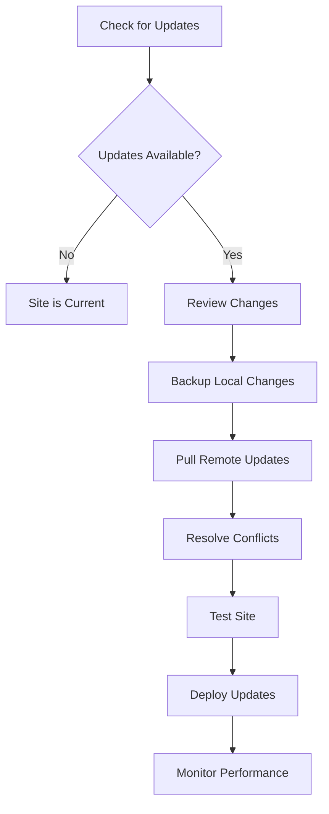

# Update Content in Your Site

## Overview
Learn how to update and maintain content in your Curvenote site, including pulling updates, managing changes, and keeping your site current

This guide covers the process of updating content in your Curvenote site, from pulling the latest changes from linked projects to managing local modifications and ensuring your site stays current with the latest content and features.

## Before You Start

Make sure you have:
- Curvenote CLI installed and authorized
- A local Curvenote project with linked content
- Understanding of basic content management concepts
- Git repository set up (recommended for version control)
- Backup of important local changes

## 1. Understand Content Update Types

Learn about different ways content can be updated:

### Update Categories
```yaml
# Content update types
update_types:
  remote_updates:
    - "New articles from Curvenote"
    - "Updated notebooks"
    - "Modified images and media"
    - "Configuration changes"
  
  local_modifications:
    - "Custom navigation changes"
    - "Local content additions"
    - "Configuration tweaks"
    - "Custom styling"
  
  system_updates:
    - "Curvenote platform updates"
    - "CLI tool improvements"
    - "New features and capabilities"
    - "Bug fixes and patches"
```

### Update Workflow


## 2. Check for Available Updates

Monitor your site for available updates:

### Check Update Status
```bash
# Check status of all linked projects
curvenote status

# Check status of specific project
curvenote status --project project-name

# Check with detailed output
curvenote status --verbose
```

### Update Monitoring Script
```python
# update_monitor.py
import subprocess
import json
from datetime import datetime

class UpdateMonitor:
    def __init__(self):
        self.last_check = None
        self.update_history = []
    
    def check_for_updates(self):
        """Check for available updates."""
        try:
            result = subprocess.run(
                ['curvenote', 'status', '--json'],
                capture_output=True,
                text=True
            )
            
            if result.returncode == 0:
                status_data = json.loads(result.stdout)
                self.last_check = datetime.now()
                
                updates_available = []
                for project in status_data.get('projects', []):
                    if project.get('has_updates', False):
                        updates_available.append({
                            'name': project.get('name'),
                            'last_update': project.get('last_update'),
                            'changes': project.get('changes', [])
                        })
                
                return updates_available
            else:
                print(f"Error checking status: {result.stderr}")
                return []
                
        except Exception as e:
            print(f"Exception checking updates: {e}")
            return []
    
    def log_update_check(self, updates_found):
        """Log update check results."""
        self.update_history.append({
            'timestamp': datetime.now(),
            'updates_found': len(updates_found),
            'details': updates_found
        })
    
    def get_update_summary(self):
        """Get summary of recent update activity."""
        if not self.update_history:
            return "No update history available"
        
        recent_checks = self.update_history[-10:]  # Last 10 checks
        total_updates = sum(check['updates_found'] for check in recent_checks)
        
        return {
            'total_checks': len(recent_checks),
            'total_updates_found': total_updates,
            'last_check': self.last_check,
            'average_updates_per_check': total_updates / len(recent_checks) if recent_checks else 0
        }

# Usage example
monitor = UpdateMonitor()
updates = monitor.check_for_updates()
monitor.log_update_check(updates)

if updates:
    print(f"Found {len(updates)} projects with updates:")
    for update in updates:
        print(f"- {update['name']}: {len(update['changes'])} changes")
else:
    print("No updates available")
```

### Automated Update Checking
```bash
# Create a script to check for updates
#!/bin/bash
# check_updates.sh

echo "Checking for Curvenote updates..."
curvenote status

if [ $? -eq 0 ]; then
    echo "Update check completed successfully"
else
    echo "Error checking for updates"
    exit 1
fi
```

## 3. Pull Remote Updates

Update your local content with the latest changes:

### Basic Pull Operations
```bash
# Pull updates from all linked projects
curvenote pull

# Pull updates from specific project
curvenote pull --project project-name

# Pull with confirmation disabled
curvenote pull --yes

# Pull with clean option (removes local changes)
curvenote pull --clean
```

### Pull with Options
```bash
# Pull with specific options
curvenote pull \
  --project my-blog \
  --force \
  --clean \
  --verbose

# Pull and backup local changes
curvenote pull --backup-local-changes

# Pull with conflict resolution
curvenote pull --resolve-conflicts auto
```

### Pull Workflow Script
```python
# pull_workflow.py
import subprocess
import os
import shutil
from datetime import datetime

def backup_local_changes():
    """Create backup of local changes before pulling."""
    backup_dir = f"backup_{datetime.now().strftime('%Y%m%d_%H%M%S')}"
    
    if not os.path.exists(backup_dir):
        os.makedirs(backup_dir)
    
    # Copy content directory
    if os.path.exists('content'):
        shutil.copytree('content', f"{backup_dir}/content")
    
    # Copy configuration files
    config_files = ['curvenote.yml', '_toc.yml']
    for file in config_files:
        if os.path.exists(file):
            shutil.copy2(file, backup_dir)
    
    print(f"Backup created in {backup_dir}")
    return backup_dir

def pull_updates(project_name=None, clean=False, force=False):
    """Pull updates with error handling."""
    try:
        # Create backup if not using clean option
        if not clean:
            backup_local_changes()
        
        # Build pull command
        cmd = ['curvenote', 'pull']
        
        if project_name:
            cmd.extend(['--project', project_name])
        
        if clean:
            cmd.append('--clean')
        
        if force:
            cmd.append('--force')
        
        # Execute pull
        result = subprocess.run(cmd, capture_output=True, text=True)
        
        if result.returncode == 0:
            print("✓ Updates pulled successfully")
            return True
        else:
            print(f"✗ Pull failed: {result.stderr}")
            return False
            
    except Exception as e:
        print(f"Exception during pull: {e}")
        return False

def verify_pull_success():
    """Verify that pull was successful."""
    # Check if content files exist
    content_dirs = ['content']
    
    for dir_path in content_dirs:
        if not os.path.exists(dir_path):
            print(f"✗ Content directory missing: {dir_path}")
            return False
    
    # Check if configuration files are valid
    try:
        subprocess.run(['curvenote', 'check'], check=True)
        print("✓ Configuration validation passed")
        return True
    except subprocess.CalledProcessError:
        print("✗ Configuration validation failed")
        return False

# Usage
if __name__ == "__main__":
    success = pull_updates(clean=True)
    if success:
        verify_pull_success()
```

## 4. Manage Local Changes

Handle local modifications and customizations:

### Local Change Management
```python
# local_changes.py
import os
import git
from pathlib import Path

class LocalChangeManager:
    def __init__(self, repo_path='.'):
        self.repo_path = repo_path
        self.repo = git.Repo(repo_path)
    
    def get_local_changes(self):
        """Get list of local changes."""
        changes = {
            'modified': [],
            'added': [],
            'deleted': [],
            'untracked': []
        }
        
        # Get modified files
        for item in self.repo.index.diff(None):
            changes['modified'].append(item.a_path)
        
        # Get staged changes
        for item in self.repo.index.diff('HEAD'):
            changes['modified'].append(item.a_path)
        
        # Get untracked files
        for file_path in self.repo.untracked_files:
            changes['untracked'].append(file_path)
        
        return changes
    
    def backup_changes(self, backup_dir):
        """Backup local changes to specified directory."""
        changes = self.get_local_changes()
        
        if not any(changes.values()):
            print("No local changes to backup")
            return
        
        os.makedirs(backup_dir, exist_ok=True)
        
        for change_type, files in changes.items():
            if files:
                type_dir = os.path.join(backup_dir, change_type)
                os.makedirs(type_dir, exist_ok=True)
                
                for file_path in files:
                    if os.path.exists(file_path):
                        dest_path = os.path.join(type_dir, file_path)
                        os.makedirs(os.path.dirname(dest_path), exist_ok=True)
                        
                        if os.path.isfile(file_path):
                            import shutil
                            shutil.copy2(file_path, dest_path)
        
        print(f"Local changes backed up to {backup_dir}")
    
    def restore_changes(self, backup_dir):
        """Restore local changes from backup."""
        if not os.path.exists(backup_dir):
            print(f"Backup directory not found: {backup_dir}")
            return False
        
        for change_type in ['modified', 'added', 'untracked']:
            type_dir = os.path.join(backup_dir, change_type)
            if os.path.exists(type_dir):
                for root, dirs, files in os.walk(type_dir):
                    for file in files:
                        backup_file = os.path.join(root, file)
                        relative_path = os.path.relpath(backup_file, type_dir)
                        target_file = os.path.join(self.repo_path, relative_path)
                        
                        os.makedirs(os.path.dirname(target_file), exist_ok=True)
                        import shutil
                        shutil.copy2(backup_file, target_file)
        
        print("Local changes restored from backup")
        return True

# Usage
manager = LocalChangeManager()
changes = manager.get_local_changes()

if any(changes.values()):
    print("Local changes detected:")
    for change_type, files in changes.items():
        if files:
            print(f"  {change_type}: {len(files)} files")
    
    # Backup changes before pull
    manager.backup_changes("backup_local_changes")
```

### Conflict Resolution
```python
# conflict_resolver.py
import os
import difflib
import subprocess

class ConflictResolver:
    def __init__(self):
        self.conflicts = []
    
    def detect_conflicts(self):
        """Detect merge conflicts in content."""
        conflicts = []
        
        # Check for conflict markers in files
        for root, dirs, files in os.walk('content'):
            for file in files:
                if file.endswith(('.md', '.ipynb')):
                    file_path = os.path.join(root, file)
                    if self.has_conflict_markers(file_path):
                        conflicts.append(file_path)
        
        self.conflicts = conflicts
        return conflicts
    
    def has_conflict_markers(self, file_path):
        """Check if file contains conflict markers."""
        try:
            with open(file_path, 'r') as f:
                content = f.read()
                return any(marker in content for marker in ['<<<<<<<', '=======', '>>>>>>>'])
        except Exception:
            return False
    
    def resolve_conflicts(self, strategy='manual'):
        """Resolve conflicts using specified strategy."""
        if not self.conflicts:
            print("No conflicts detected")
            return True
        
        print(f"Found {len(self.conflicts)} conflicts")
        
        if strategy == 'auto':
            return self.auto_resolve()
        else:
            return self.manual_resolve()
    
    def auto_resolve(self):
        """Automatically resolve conflicts."""
        for conflict_file in self.conflicts:
            print(f"Auto-resolving: {conflict_file}")
            
            # Simple auto-resolution: keep both versions
            with open(conflict_file, 'r') as f:
                content = f.read()
            
            # Remove conflict markers and keep both versions
            resolved_content = self.remove_conflict_markers(content)
            
            with open(conflict_file, 'w') as f:
                f.write(resolved_content)
        
        return True
    
    def manual_resolve(self):
        """Guide user through manual conflict resolution."""
        for conflict_file in self.conflicts:
            print(f"\nConflict in: {conflict_file}")
            print("Please resolve conflicts manually and press Enter to continue...")
            input()
        
        return True
    
    def remove_conflict_markers(self, content):
        """Remove Git conflict markers from content."""
        lines = content.split('\n')
        resolved_lines = []
        in_conflict = False
        
        for line in lines:
            if line.startswith('<<<<<<<') or line.startswith('=======') or line.startswith('>>>>>>>'):
                in_conflict = not in_conflict
                continue
            
            if not in_conflict:
                resolved_lines.append(line)
        
        return '\n'.join(resolved_lines)

# Usage
resolver = ConflictResolver()
conflicts = resolver.detect_conflicts()

if conflicts:
    print(f"Found {len(conflicts)} conflicts to resolve")
    resolver.resolve_conflicts(strategy='manual')
else:
    print("No conflicts detected")
```

## 5. Test Updated Content

Validate your updated content before deployment:

### Content Testing
```bash
# Test local site
curvenote start

# Build site for testing
curvenote build

# Validate configuration
curvenote check

# Test specific components
curvenote test --component navigation
curvenote test --component links
```

### Automated Testing Script
```python
# test_updated_content.py
import subprocess
import time
import requests
from pathlib import Path

class ContentTester:
    def __init__(self):
        self.test_results = {}
    
    def test_build(self):
        """Test if site builds successfully."""
        print("Testing site build...")
        
        start_time = time.time()
        result = subprocess.run(['curvenote', 'build'], capture_output=True, text=True)
        build_time = time.time() - start_time
        
        if result.returncode == 0:
            self.test_results['build'] = {
                'status': 'passed',
                'time': build_time,
                'message': 'Site builds successfully'
            }
            print(f"✓ Build successful in {build_time:.2f} seconds")
            return True
        else:
            self.test_results['build'] = {
                'status': 'failed',
                'error': result.stderr,
                'message': 'Build failed'
            }
            print(f"✗ Build failed: {result.stderr}")
            return False
    
    def test_configuration(self):
        """Test configuration validity."""
        print("Testing configuration...")
        
        result = subprocess.run(['curvenote', 'check'], capture_output=True, text=True)
        
        if result.returncode == 0:
            self.test_results['config'] = {
                'status': 'passed',
                'message': 'Configuration is valid'
            }
            print("✓ Configuration is valid")
            return True
        else:
            self.test_results['config'] = {
                'status': 'failed',
                'error': result.stderr,
                'message': 'Configuration has issues'
            }
            print(f"✗ Configuration issues: {result.stderr}")
            return False
    
    def test_content_structure(self):
        """Test content structure and files."""
        print("Testing content structure...")
        
        issues = []
        
        # Check for required files
        required_files = ['index.md', 'curvenote.yml']
        for file in required_files:
            if not Path(file).exists():
                issues.append(f"Missing required file: {file}")
        
        # Check markdown files
        md_files = list(Path('content').rglob('*.md'))
        for md_file in md_files:
            if md_file.stat().st_size == 0:
                issues.append(f"Empty markdown file: {md_file}")
        
        if not issues:
            self.test_results['structure'] = {
                'status': 'passed',
                'message': 'Content structure is valid'
            }
            print("✓ Content structure is valid")
            return True
        else:
            self.test_results['structure'] = {
                'status': 'failed',
                'issues': issues,
                'message': 'Content structure has issues'
            }
            print(f"✗ Content structure issues: {issues}")
            return False
    
    def test_local_server(self, port=8000):
        """Test local development server."""
        print(f"Testing local server on port {port}...")
        
        try:
            # Start server in background
            server_process = subprocess.Popen(
                ['curvenote', 'start', '--port', str(port)],
                stdout=subprocess.PIPE,
                stderr=subprocess.PIPE
            )
            
            # Wait for server to start
            time.sleep(5)
            
            # Test server response
            response = requests.get(f'http://localhost:{port}', timeout=10)
            
            if response.status_code == 200:
                self.test_results['server'] = {
                    'status': 'passed',
                    'message': 'Local server is working'
                }
                print("✓ Local server is working")
                success = True
            else:
                self.test_results['server'] = {
                    'status': 'failed',
                    'status_code': response.status_code,
                    'message': 'Local server not responding correctly'
                }
                print(f"✗ Server returned status {response.status_code}")
                success = False
            
            # Stop server
            server_process.terminate()
            server_process.wait()
            
            return success
            
        except Exception as e:
            self.test_results['server'] = {
                'status': 'failed',
                'error': str(e),
                'message': 'Local server test failed'
            }
            print(f"✗ Server test failed: {e}")
            return False
    
    def run_all_tests(self):
        """Run all content tests."""
        tests = [
            self.test_build,
            self.test_configuration,
            self.test_content_structure,
            self.test_local_server
        ]
        
        results = []
        for test in tests:
            try:
                result = test()
                results.append(result)
            except Exception as e:
                print(f"Test failed with exception: {e}")
                results.append(False)
        
        all_passed = all(results)
        
        if all_passed:
            print("\n🎉 All tests passed!")
        else:
            print("\n❌ Some tests failed")
        
        return all_passed, self.test_results

# Usage
tester = ContentTester()
success, results = tester.run_all_tests()

if success:
    print("Content is ready for deployment")
else:
    print("Content needs fixes before deployment")
```

## 6. Deploy Updates

Deploy your updated content to production:

### Deployment Process
```bash
# Deploy to Curvenote
curvenote deploy

# Deploy with specific options
curvenote deploy --project my-site --public

# Deploy to custom domain
curvenote deploy --domain mysite.com

# Deploy with preview
curvenote deploy --preview
```

### Deployment Script
```python
# deploy_updates.py
import subprocess
import time
import requests

class UpdateDeployer:
    def __init__(self, project_name=None, domain=None):
        self.project_name = project_name
        self.domain = domain
    
    def deploy(self, preview=False, public=True):
        """Deploy updates to Curvenote."""
        print("Deploying updates...")
        
        # Build command
        cmd = ['curvenote', 'deploy']
        
        if self.project_name:
            cmd.extend(['--project', self.project_name])
        
        if self.domain:
            cmd.extend(['--domain', self.domain])
        
        if preview:
            cmd.append('--preview')
        
        if public:
            cmd.append('--public')
        
        # Execute deployment
        start_time = time.time()
        result = subprocess.run(cmd, capture_output=True, text=True)
        deploy_time = time.time() - start_time
        
        if result.returncode == 0:
            print(f"✓ Deployment successful in {deploy_time:.2f} seconds")
            
            # Extract deployment URL from output
            deployment_url = self.extract_deployment_url(result.stdout)
            if deployment_url:
                print(f"Deployment URL: {deployment_url}")
            
            return True, deployment_url
        else:
            print(f"✗ Deployment failed: {result.stderr}")
            return False, None
    
    def extract_deployment_url(self, output):
        """Extract deployment URL from command output."""
        lines = output.split('\n')
        for line in lines:
            if 'curve.space' in line or 'curvenote.com' in line:
                return line.strip()
        return None
    
    def verify_deployment(self, url, timeout=60):
        """Verify deployment is accessible."""
        print(f"Verifying deployment at {url}...")
        
        start_time = time.time()
        while time.time() - start_time < timeout:
            try:
                response = requests.get(url, timeout=10)
                if response.status_code == 200:
                    print("✓ Deployment verified and accessible")
                    return True
            except requests.RequestException:
                pass
            
            time.sleep(5)
        
        print("✗ Deployment verification failed")
        return False
    
    def rollback_deployment(self):
        """Rollback to previous deployment if needed."""
        print("Rolling back deployment...")
        
        cmd = ['curvenote', 'deploy', '--rollback']
        if self.project_name:
            cmd.extend(['--project', self.project_name])
        
        result = subprocess.run(cmd, capture_output=True, text=True)
        
        if result.returncode == 0:
            print("✓ Rollback successful")
            return True
        else:
            print(f"✗ Rollback failed: {result.stderr}")
            return False

# Usage
deployer = UpdateDeployer(project_name="my-site")
success, url = deployer.deploy(preview=False, public=True)

if success and url:
    deployer.verify_deployment(url)
```

## 7. Monitor and Maintain

Keep your site running smoothly after updates:

### Performance Monitoring
```python
# performance_monitor.py
import time
import requests
import psutil
import subprocess

class PerformanceMonitor:
    def __init__(self, site_url):
        self.site_url = site_url
        self.metrics = []
    
    def measure_load_time(self):
        """Measure site load time."""
        try:
            start_time = time.time()
            response = requests.get(self.site_url, timeout=30)
            load_time = time.time() - start_time
            
            metric = {
                'timestamp': time.time(),
                'load_time': load_time,
                'status_code': response.status_code,
                'content_length': len(response.content)
            }
            
            self.metrics.append(metric)
            
            if load_time < 3:
                print(f"✓ Fast load time: {load_time:.2f}s")
            elif load_time < 10:
                print(f"⚠ Moderate load time: {load_time:.2f}s")
            else:
                print(f"✗ Slow load time: {load_time:.2f}s")
            
            return metric
            
        except Exception as e:
            print(f"✗ Load time measurement failed: {e}")
            return None
    
    def check_system_resources(self):
        """Check system resource usage."""
        cpu_percent = psutil.cpu_percent()
        memory_percent = psutil.virtual_memory().percent
        disk_percent = psutil.disk_usage('/').percent
        
        print(f"System resources - CPU: {cpu_percent}%, Memory: {memory_percent}%, Disk: {disk_percent}%")
        
        return {
            'cpu': cpu_percent,
            'memory': memory_percent,
            'disk': disk_percent
        }
    
    def generate_performance_report(self):
        """Generate performance report."""
        if not self.metrics:
            return "No metrics available"
        
        load_times = [m['load_time'] for m in self.metrics if m['load_time']]
        
        if load_times:
            avg_load_time = sum(load_times) / len(load_times)
            max_load_time = max(load_times)
            min_load_time = min(load_times)
            
            report = {
                'total_measurements': len(self.metrics),
                'average_load_time': avg_load_time,
                'max_load_time': max_load_time,
                'min_load_time': min_load_time,
                'performance_rating': self.get_performance_rating(avg_load_time)
            }
            
            return report
        
        return "No valid load time measurements"

# Usage
monitor = PerformanceMonitor("https://mysite.curve.space")
monitor.measure_load_time()
monitor.check_system_resources()
report = monitor.generate_performance_report()
print(f"Performance report: {report}")
```

### Maintenance Schedule
```yaml
# maintenance_schedule.yml
maintenance_tasks:
  daily:
    - "Check for updates"
    - "Monitor site performance"
    - "Review error logs"
  
  weekly:
    - "Pull latest updates"
    - "Test site functionality"
    - "Backup content"
    - "Update dependencies"
  
  monthly:
    - "Review content structure"
    - "Optimize performance"
    - "Update documentation"
    - "Security audit"
  
  quarterly:
    - "Major content review"
    - "Site redesign planning"
    - "Feature updates"
    - "User feedback analysis"
```

## 8. Troubleshoot Update Issues

Handle common update problems:

### Common Issues and Solutions
```python
# update_troubleshooter.py
import subprocess
import os
import json

class UpdateTroubleshooter:
    def __init__(self):
        self.issues = []
    
    def diagnose_common_issues(self):
        """Diagnose common update issues."""
        print("Diagnosing update issues...")
        
        # Check CLI installation
        if not self.check_cli_installation():
            self.issues.append("CLI not properly installed")
        
        # Check authorization
        if not self.check_authorization():
            self.issues.append("Not authorized with Curvenote")
        
        # Check network connectivity
        if not self.check_network():
            self.issues.append("Network connectivity issues")
        
        # Check project configuration
        if not self.check_project_config():
            self.issues.append("Project configuration issues")
        
        return self.issues
    
    def check_cli_installation(self):
        """Check if CLI is properly installed."""
        try:
            result = subprocess.run(['curvenote', '--version'], capture_output=True, text=True)
            return result.returncode == 0
        except FileNotFoundError:
            return False
    
    def check_authorization(self):
        """Check if user is authorized."""
        try:
            result = subprocess.run(['curvenote', 'whoami'], capture_output=True, text=True)
            return result.returncode == 0
        except Exception:
            return False
    
    def check_network(self):
        """Check network connectivity."""
        try:
            import requests
            response = requests.get('https://curvenote.com', timeout=10)
            return response.status_code == 200
        except Exception:
            return False
    
    def check_project_config(self):
        """Check project configuration."""
        required_files = ['curvenote.yml']
        for file in required_files:
            if not os.path.exists(file):
                return False
        return True
    
    def fix_common_issues(self):
        """Attempt to fix common issues."""
        fixes_applied = []
        
        for issue in self.issues:
            if "CLI not properly installed" in issue:
                print("Installing CLI...")
                # Add CLI installation commands
                fixes_applied.append("CLI installation")
            
            elif "Not authorized" in issue:
                print("Re-authorizing...")
                subprocess.run(['curvenote', 'login'])
                fixes_applied.append("Re-authorization")
            
            elif "Project configuration" in issue:
                print("Fixing project configuration...")
                # Add configuration fix commands
                fixes_applied.append("Configuration fix")
        
        return fixes_applied

# Usage
troubleshooter = UpdateTroubleshooter()
issues = troubleshooter.diagnose_common_issues()

if issues:
    print(f"Found {len(issues)} issues:")
    for issue in issues:
        print(f"- {issue}")
    
    fixes = troubleshooter.fix_common_issues()
    print(f"Applied {len(fixes)} fixes")
else:
    print("No issues detected")
```

## Next Steps

- [Learn about Adding Content →](./adding-content.md)
- [Customize Site Design →](./site-design/layout-and-theme.md)
- [Configure Navigation →](./site-design/navigation.md)
- [Deploy Your Site →](./tutorial-deploy-project.md)
- [Manage Multiple Projects →](./sites/index.md)

---

💡 **Tip:** Always backup your local changes before pulling updates, and test your site thoroughly after any major updates.

⚡ **Important: Update Management Best Practices**

- **Backup first**: Always backup local changes before pulling updates
- **Test thoroughly**: Validate content and functionality after updates
- **Monitor performance**: Track site performance after updates
- **Version control**: Use Git to track changes and enable rollbacks
- **Document changes**: Keep records of what was updated and when
- **Plan updates**: Schedule updates during low-traffic periods
